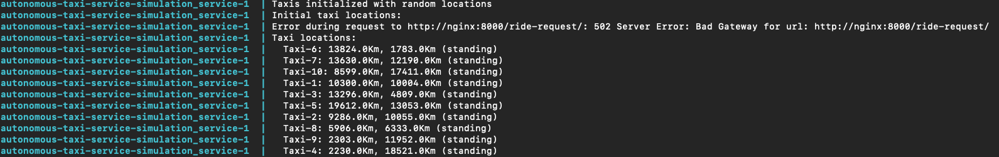

# Autonomous Taxi Service Simulation

Welcome to the **Autonomous Taxi Service Simulation**, a live simulation of an autonomous taxi service operating in a futuristic city, `futureTLV`.

## Overview
This project simulates an autonomous taxi service, where:
- 10 taxis move on a 20km x 20km city grid.
- Taxis operate at 72km/h (20 meters/second), restricted to X and Y axes with 90-degree turns.
- The system processes ride requests every 20 seconds, assigning the nearest available taxi.

## Features
- **Taxi Initialization:** Each taxi starts at a random location and is initially standing still.
- **Ride Request Handling:** A new ride request is generated every 20 seconds.
- **Taxi Movement:** Taxis move towards their destinations, following the grid rules.
- **Queue Management:** Unallocated requests remain in the queue until taxis become available.
- **Real-Time Updates:** The system prints the current state of taxis and the ride queue at every interval.

## Architecture
The project follows a **microservices-based architecture**:

### Services
- **Taxi Service**: Manages taxi locations, movements, and availability.
- **Ride Request Service**: Handles the ride request queue.
- **Dispatcher Service**: Allocates taxis to ride requests.
- **Simulation Service**: Simulates the system and provides live updates.
- **API Gateway**: Acts as a single entry point for routing requests.

### Technologies Used
- **FastAPI**: Framework for building the services.
- **Redis**: In-memory database for managing taxis and ride data.
- **RabbitMQ**: Message broker for handling ride requests.
- **Docker**: Containerization of services.
- **Docker Compose**: Multi-service orchestration.

## Setup
### Prerequisites
- Docker and Docker Compose installed.

### Environment Variables
Create a `.env` file with the following content:
```plaintext
REDIS_HOST=redis
REDIS_PORT=6379

RABBITMQ_HOST=rabbitmq
RABBITMQ_PORT=5672

APP_ENV=development
DEBUG=true
```

### Running the Simulation
1. Clone this repository:
   ```bash
   git clone https://github.com/idoziv15/autonomous-taxi-service.git
   cd autonomous-taxi-service
   ```
2. Build and run the services:
   #### Option 1:
   ```bash
   docker-compose up --build
   ```
   #### Option 2:
   Run the following command to grant execute permissions (On macOS or Linux, or with Windows Git Bash or WSL):

   ```bash
   chmod +x ./scripts/start_app.sh
   ```

   Use this script to build and initialize all the services.
   ```bash
   ./scripts/start_app.sh
   ```

3. Monitor the simulation in the console. After all the timeouts intervals will be over, you will be able to see all the required prints of the simulation.

## Usage
The simulation automatically:
- Initializes taxis with random locations.
- Generates ride requests every 20 seconds.
- Updates taxi locations and queue states in real time.

## Project Structure
```plaintext
autonomous-taxi-service/
├── gateway/                     # API Gateway
│   ├── Dockerfile
│   └── gateway.py               # Routes requests to services
├── scripts/                     # Scripts for easy use
├── services/
│   ├── ride_request_service/    # Manages ride requests
│   │   ├── Dockerfile
│   │   └── ride_service.py
│   ├── taxi_service/            # Handles taxi logic
│   │   ├── Dockerfile
│   │   ├── utils.py
│   │   └── taxi_service.py
│   ├── dispatcher_service/      # Assigns taxis to rides
│   │   ├── Dockerfile
│   │   ├── utils.py
│   │   └── dispatcher_service.py
│   └── simulation_service/      # Simulates the system
│       ├── Dockerfile
│       └── simulation.py
├── shared/                      # Shared utilities
│   ├── database.py              # Redis connection setup
│   └── models.py                # Models for the project
├── docker-compose.yml           # Multi-service orchestration
└── requirements.txt             # Python dependencies
```

## System Design Diagram


## Utility Scripts

### `reset_redis.sh`
Use this script to clear all data stored in Redis. 
This is useful when you want to reset the state of taxis and other in-memory data.

**Usage:**
```bash
./scripts/reset_redis.sh
```

### `reset_rabbitmq.sh`
Use this script to clear all ride requests in RabbitMQ's queues.
This is useful when you want to reset the ride request queue.

**Usage:**
```bash
./scripts/reset_rabbitmq.sh
```

**Simulation Pictures:**


